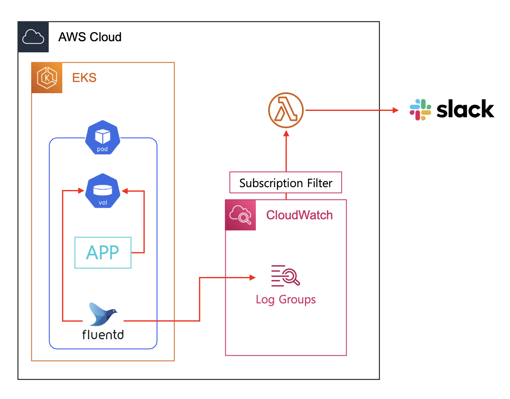

> ## Logging (Fluentd & AWS CloudWatch & AWS Lambda)

### 목표
- Application(Container)의 로그중 특정 로그의 내용을 Slack으로 알림을 받는 모델을 구축합니다.
---

### 구성도


<br>

> ### Cloudwatch 구독 필터 패턴 설정
<link>https://docs.aws.amazon.com/AmazonCloudWatch/latest/logs/FilterAndPatternSyntax.html</link>

```
# Log(JSON) 예시
{
    "log":"492: logging update\n",
    "stream":"stdout",
    "docker":{
        "container_id":"1664a08e2e555db58c8da287c9e94fe9567db40a6e0080bed5a573122e374fc4"
        },
        "kubernetes":{
            "container_name":"example-log",
            "namespace_name":"kube-example",
            "pod_name":"example-web-app-68f99f459d-5mlqk",
            "container_image":"busybox:latest",
            "container_image_id":"docker-pullable://busybox@sha256:15e927f78df2cc772b70713543d6b651e3cd8370abf86b2ea4644a9fba21107f",
            "pod_id":"349362ea-c5cb-43f7-a71d-90e9d005db48",
            "host":"ip-10-0-2-109.ap-northeast-2.compute.internal",
            "labels":{
                "app":"example-web-app",
                "pod-template-hash":"68f99f459d"
                },
            "master_url":"https://172.20.0.1:443/api",
            "namespace_id":"0a07d5ef-7856-4ea0-9825-f227532a675a",
            "namespace_labels":{
                "kubernetes_io/metadata_name":"kube-example"
                }
            }
}

# Container_name이 example-log값 필터링
{ $.kubernetes.container_name = "example-log" }

# Log 내용 필터링
{ $.log = "491:*" } # 491: 로 시작하는 모든 로그 필터링
```

> ### Lambda Function에서 사용 값 가공

로그필터로 구독시 Event에 대한 Lambda 호출시에 event값은 바로 log 값이 전달되지는 않습니다.  
CloudWatch Event에서 보내는 data값을 바이트코드로 변환하는 작업이 필요합니다.

```
# CloudWatch Log Event Value 예제
{
  "awslogs": {
    "data": "H4sIAAAAAAAAAHWPwQqCQBCGX0Xm7EFtK+smZBEUgXoLCdMhFtKV3akI8d0bLYmibvPPN3wz00CJxmQnTO41whwWQRIctmEcB6sQbFC3CjW3XW8kxpOpP+OC22d1Wml1qZkQGtoMsScxaczKN3plG8zlaHIta5KqWsozoTYw3/djzwhpLwivWFGHGpAFe7DL68JlBUk+l7KSN7tCOEJ4M3/qOI49vMHj+zCKdlFqLaU2ZHV2a4Ct/an0/ivdX8oYc1UVX860fQDQiMdxRQEAAA=="
  }
}
```

> ### 실습 구현 단계

1. AWS EKS를 Terraform으로 구축 - <link>github.com/eocis/container</link>참고 및 추가  
2. Fluentd yaml 수정(stage/k8s/fluentd.yaml) - AWS github CloudWatch Agent(fluentd) 사용  
3. 로그 생성 Pod yaml 작성(stage/k8s/apply.yaml) - busybox image 사용  
4. Lambda Function 작성(stage/lambda/slack.py) - Bludprint(cloudwatch-alarm-to-slack-python)기반 코드 커스텀  
5. CloudWatch의 Log Group의 해당 로그 확인 및 Lambda 구독필터 설정 - 패턴필터링 설정( ```{ $.log = "*error*" }``` )  
6. 1,2의 결과물 EKS Cluster에 Deploy  
7. Slack Alert 확인
